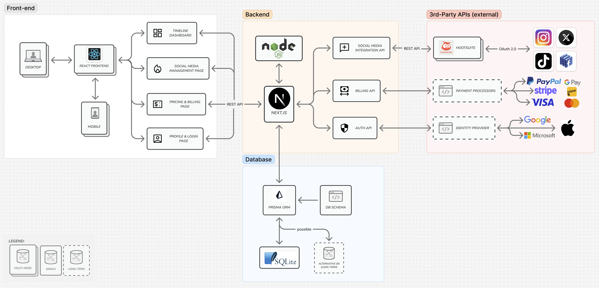

The frontend is made possible by a React web app. It connects to Next.js in the backend. In the MVP, the backend connects to a social media management API, specifically Hootsuite, which allows management of multiple social media platforms. For the database, Prisma ORM and SQLite are used. (Longer term features include billing and authentication, which will be enabled by APIs.)

