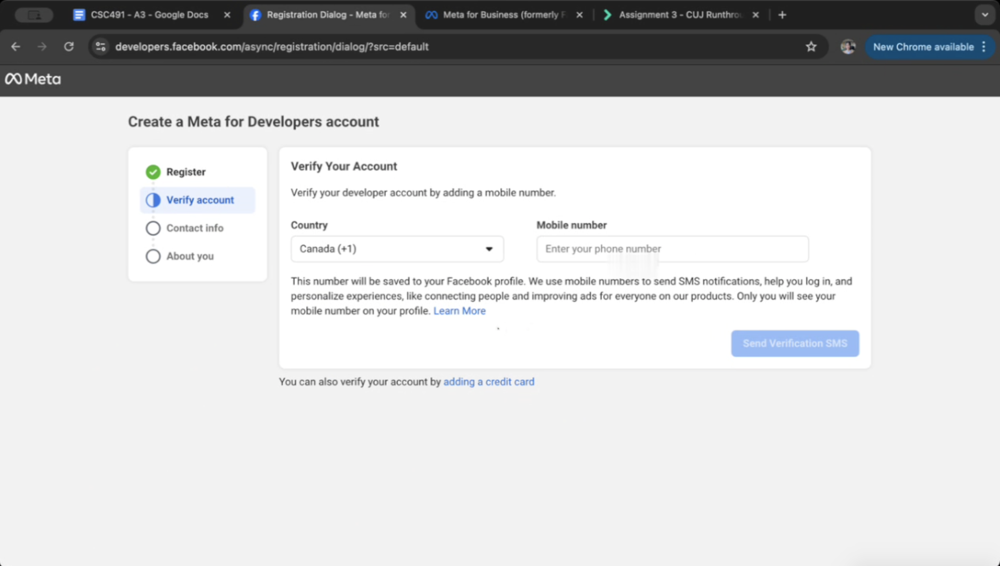
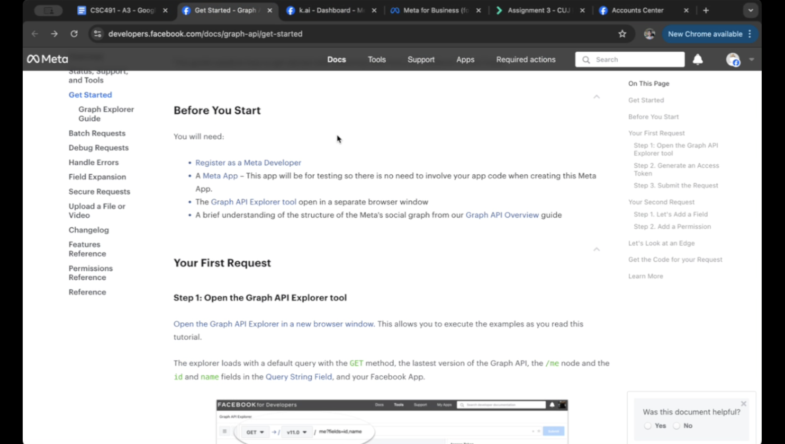

# A3 Critical User Journey (CUJ) Runthrough

## Team Constellations

Team: k.ai

Group Members:

* James Chen – 1008002135
* Kevin Hu – 1008866817
* Ali Eren Kaya – 1007315736
* Monique Mattia (CSC454) – 1005841341
* Yvonne Zhang – 1008752333

**Submission Date:** 2025/09/24

## ⚡ TL;DR
In our CUJ, a fourth-year computer science student sets up the Meta Graph API and retrieves basic information for the first time. While the API works well, during setup, enabling certain permission groups unexpectedly disabled others, causing issues in later steps. To address this, Meta should add additional information when selecting permissions, including showing a preview of enabled permissions. 

---

## 🎯 Goal

**As a 4th-year Computer Science Student, when building a centralized release hub for independent musicians, I want an easy way to manage the musicians’ social media accounts (using Meta Graph API for this CUJ), so that I can help the musicians carry out their promotional activities.**

## 🧰 Tools Used

* Meta Graph API (used to access Facebook)
* Documentation
  * Graph API Explorer (for testing API requests)
  * Meta for Developers platform
* Google Search, Claude, ChatGPT, Stack Overflow
* Facebook Accounts Centre
* SMS app on phone

## 🧑‍💻 Persona Description

* **Role / Background**: Yvonne is a 4th-year Computer Science Student at the University of Toronto with experience in programming. She has worked with backend development through internship and academic projects, which gives her fundamentals in API integration.

* **Experience Level**: Intermediate developer comfortable with REST APIs, JSON handling, and authentication flows. Yvonne has also successfully integrated Google Maps API previously, but this is her first time working specifically with Meta’s Graph API.

* **Familiarity with Platform**: Yvonne has a Facebook account that she created years ago but rarely uses actively. She’s more familiar with Instagram and WhatsApp from a user perspective. This is her first time working with social media APIs for development purposes.

* **Technical Context**: Yvonne is building a centralized release hub for independent musicians as part of her startup team k.ai, where she needs to integrate social media management capabilities to help artists promote their music.

* **Expectations**: As an experienced developer, she expects clear documentation, logical API structure, and straightforward authentication process similar to other major platform APIs she has used.

## 📘 Summary of Findings

Integrating Meta’s Graph API as a first-time user revealed significant onboard friction despite solid core functionality. For insights from our user journey, we found that the documentation was easy to find and accessible for a broad audience, and the Graph API Explorer provided an intuitive testing interface once configured. The basic API functionality worked flawlessly. (For more insights, see the later Recommendations section.) However, critical pain points emerged during setup. The developer registration process unexpectedly required an active Facebook account, and broken links within the verification process forced manual navigation instead of guided flows.

The most severe issue occurred during app creation. The interface gave no warning that selecting certain use cases would disable others, which forced a complete restart after discovering incompatible sections. The unclear descriptions made it hard to make informed decisions. Moreover, the documentation significantly misaligned with actual interface behaviour, particularly around permissions and API access. Expected capabilities weren’t available due to earlier configuration choices, which created confusion in troubleshooting.  For more severe issues, see the later Highlights and Lowlights Table.

Overall, while Meta’s Graph API delivered desired functionality for our musician promotion platform, the UX fell short of developer standards. The mismatched documentation, confusing interface, and hidden limitations create unnecessary barriers that affect first-time user adoption.

## 💡 Recommendations

### For Meta Graph API (Product Improvements)

#### Streamline the developer account onboarding process
Meta should provide a clear, step-by-step onboarding flow that walks users through account prerequisites (Facebook/Meta account, phone verification), fix the broken links within the interface, and integrate any manual steps (like Account Center verification) into the flow instead of forcing users to hunt around. They should also add a checklist that warns about missing prerequisites before users begin so fewer people are interrupted and need to verify something elsewhere in the middle of the account setup process.
#### Additional diverse multi-role selection and explain its impact
Replace the single-choice “What best describes you?” field within the developer account setup flow with a multi-select (for people with multiple roles like us, e.g. developer, student, founder) and include a short tooltip explaining why this information is requested and how it affects default settings, if there would be rate limits, or any other behaviours of the platform. Making the purpose explicit will reduce confusion and improve user trust.
#### Additional instructions for when selecting a use case when creating a new app
When choosing app use cases, surface compatibility constraints up front: show which combinations are incompatible, what permissions will be enabled/disabled for each use case, and a preview of resulting settings. Allow users to edit or switch use cases after creation (don’t “lock down” the permission settings) so selecting the wrong option doesn’t force a full restart.
#### Clearer ways to grant permissions for API keys
Update the docs with the current version of Graph API Explorer so the terminology, permission names, and flows are consistent. Improve the permissions UX (search, filters, and visibility of unavailable permissions), and add a permissions helper that updates the token with necessary permissions in one click according to the error response when using a token.

### For Future Users

#### Be ready to verify and set up your Meta account as developer
Make sure you have a Facebook/meta account, know its password, and have your phone ready to verify your number. This is not mentioned as part of the Get Started guide in the API documentation, but could certainly take some time if you haven’t got everything ready to go.
#### Confirm permissions for your API token
Don’t assume a token works for all endpoints. Before using your API for development, make sure it has the proper permission by testing it in the API explorer. If not, make sure to grant the permission and check if you have the correct use case settings. When you update permissions, generate a fresh token and re-test rather than reusing an old key.
#### Be prepared to experiment with app configurations
If you hit a roadblock like we did with permissions, create a throwaway test app and try different use-case combinations – we got our second request working this way. Keep note of the configurations that work, so you can replicate them in your application or provide complete information when searching for community solutions online.

---

## Highlights & Lowlights Table

| Task                                                             | Severity                     | Notes                                                                                                                                                                                  |
| ---------------------------------------------------------------- | ---------------------------- | -------------------------------------------------------------------------------------------------------------------------------------------------------------------------------------- |
| Register as Meta Developer                                       | **Severe**         | Need to verify phone number (unexpected). Confusing process (broken links and buttons; need to go to account center manually to verify).                                               |
| Need a Facebook account                                          | **Moderate**       | Some people might not have Facebook accounts; others might have forgotten their passwords.                                                                                             |
| What best describes you? (Select from student/dev/founder/other) | **Moderate**       | We are founder + student + developer, but we can't choose all three of them. We don’t know what choosing each option affects.                                                          |
| Create App: Some use cases gets blanked out                      | **Severe** | Some use cases are incompatible with each other. There are inconsistencies with the documentation; some choices limit available permissions with no clear way to change it afterwards. |
| Graph API explorer (First Request)                               | **Great**           | One click to send the first basic request after setup.                                                                                                                                 |
| Generate access token                                            | **Great**       | Opens in a separate pop-up window to not disrupt the current workflow.                                                |
| Search for a field / add permission (second request)             | **Severe**                   | The interface for searching permissions is very confusing. Relevant permission does not appear in search at all, and there is no apparent way to find them.                            |

---

 ## CUJ Overview Table

| Task | Time | Switches |
| ----- | ----- | ----- |
|  |  min |  |

**Total Time:** 
**Total Context Switches:** 

## Full CUJ Table (Step-by-Step Documentation)

| Step | Notes (What \+ Why) | Screenshot |
| ----- | ----- | ----- |
| 1 | Googled Graph API to access "First Request" documentation |  |
| 2 | Clicked on official documentation and navigated to "Get Started" |  |
| 3 | Reviewed Requirements: Identified what's not met |  |
| 4 (switch) | Moved to "Register as a Meta Developer" page | |
| 5 (switch) | Followed the link for registration and verification |  |
| 6 | At the verification step, UI threw an error stating mobile number verification can only be completed through the Accounts Center |  |
| 7 (error) | Link to Accounts Center does not work |  |
| 8 (switch) | Manually navigate to Facebook > Accounts Center |  |
| 9 | Open up accounts center and complete verification request | |
| 10 | Receive SMS and provide it for complete verification |  |
| 11 | Confirm email for Meta Developer account | |
|12 | Finalize account creation by choosing a category that best describes the user type |  |
| 13 (switch) |Automatically switch to Meta Apps page |  |
| 14 (switch) | Refer back to documentation and verify next requirement | |
| 15 (switch) | Navigate back to Meta Apps page |  |
| 16 |Click create app and name the app and verify app email |  |
|17 | Choose suitable use cases and specify businesses and requirements |  |
| 18 | Review and create the app |  |
| 19 (switch) |Switch back to documentation for "First Request" |  |
| 20 (switch) | Open Graph API Explorer tool | |
| 21 |Generate Access Token | |
| 22 |Click submit and receive the response for the first API call | |
|23 (switch) | Refer back to documentation for next call and navigate back to API Explorer tool |  |
| 24 |Hover over to the node tab and search the field "email" | |
|25 |Submit again and receive the error that states we require the allocation of a permission that involves email permissions | |
| 26 (error) |Because user cannot find the asked permissions in the permissions search field, start debugging the scenario |  |
| 27 (switch) |Google why user might not have access to User Data Permissions since email requires this set of permissions |  |
| 28 |After a series of searches, user decides that this situation might be triggered by the choice of use cases when creating the Meta App | |
| 29 (switch) |Navigate back to the Apps page and create an app from scratch |  |
| 30 | Follow the app creation dialogue but specify the use case as "No Use Case" | |
|31 |After finalizing app creation, add email permissions under User Data Permissions |  |
| 32 |Add email field under the node tab |  |
|33 | Generate Access Token |  |
| 34 | Click submit and receive the response body with id, name, and email |  |
