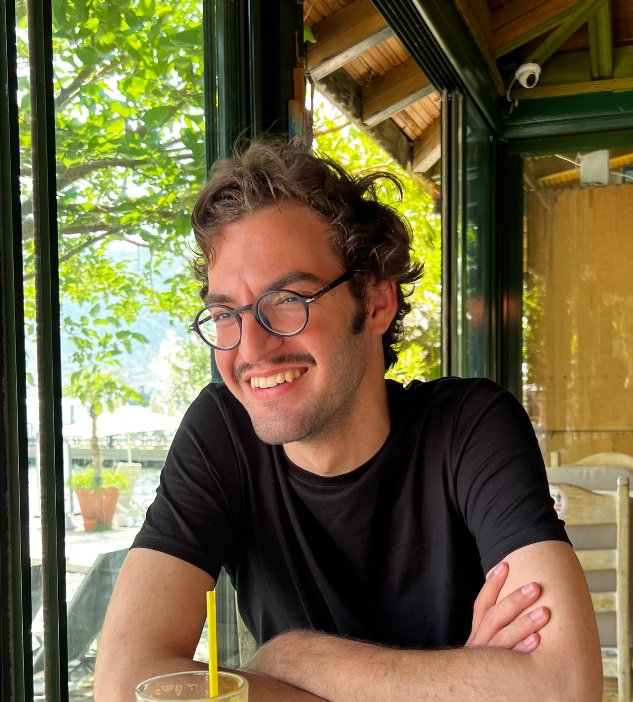

# Ali Eren Kaya

- 4th Year Computer Science Major & Mathematics, Art History Minor
- alieren.kaya@mail.utoronto.ca

## Links

- [GitHub](https://github.com/alieren1805)
- [LinkedIn](www.linkedin.com/in/ali-eren-kaya)
- [Resume](https://drive.google.com/file/d/1pi6n4zxdfUj3zPUEei6yhB5SiWspNZof/view?usp=sharing)

## About Ali

Ali is from Istanbul, Turkey. He has industry experience as a Product Manager in an Agile environment of high customer involvement, in addition to earlier development roles. He enjoys anything creative: art, music, literature...

## Strengths

- Calmness
- Leadership
- Fast Learning
- Creativity

## Weaknesses

- Could have too many interests, might cause distractions here and there...
- Sometimes too stress-free
- Perfectionism, getting stuck in loops before starting things
